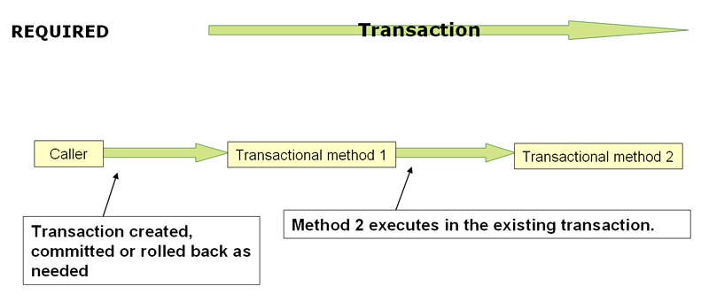
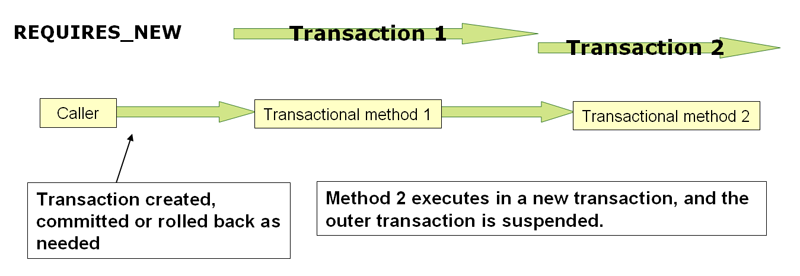

# 📖 트랜잭션과 스프링 트랜잭션

## 학습 목표

- 데이터베이스 트랜잭션에 대해 학습한다.
- 스프링에서 지원하는 트랜잭션을 학습한다.

## 학습 순서

- 트랜잭션에 대한 개념 정리
- 학습한 내용을 바탕으로 실습 진행한다.
    - 트랜잭션 격리 레벨이 실제로 어떻게 동작하는지 stage0에서 확인한다.
    - 트랜잭션 전파가 실제로 어떻게 동작하는지 stage1에서 확인한다.

## 트랜잭션이란?

- [Database transaction](https://en.wikipedia.org/wiki/Database_transaction)
- 데이터의 정합성을 보장하기 위해 고안된 방법이다.
- 다른 트랜잭션과 독립적이고 일관되고 신뢰할 수 있는 방식으로 처리되어야 한다.
- 트랜잭션의 목적
    - 오류로부터 복구를 허용하고 데이터베이스를 일관성 있게 유지하는 안정적인 작업 단위를 제공한다.
        - 동시에 접근하는 여러 프로그램 간에 격리를 제공한다.

## ACID

- 앞에서 설명한 트랜잭션의 목적을 달성하기 위해 트랜잭션이 가져야 하는 속성
- 원자성(Atomicity)
    - 트랜잭션에 포함된 모든 작업이 모두 성공(Commit)하거나 실패(Rollback)해야 한다.
- 일관성(Consistency)
    - 트랜잭션을 실행한 전후에는 데이터의 일관성이 손상되지 않아야 한다.
- 격리성(독립성)(Isolation)
    - 동시에 실행하는 여러 개의 트랜잭션이 서로 영향을 주지 않아야 한다.
- 영속성(지속성)(Durability)
    - 커밋이 완료된 트랜잭션은 손상되지 않는 성질을 말한다.

## Isolation Level

- 트랜잭션이 얼마나 서로 독립적인지 나타내는 개념이다.
    - 왜 트랜잭션이 독립적이어야 할까?
        - 다양한 비정상(Anomaly) 상태, 현상을 방지하기 위해서다.
    - 비정상적인 상태가 왜 나타나는가?
        - 동시에 여러 클라이언트가 데이터에 접근하고 수정하기 때문이다.
    - 어떤 읽기 현상이 발생 할 수 있을까?
        - Dirty reads
        - Non-repeatable reads
        - Phantom reads
- 격리 레벨은 어떤 것이 있을까?
    - Read Uncommitted
    - Read Committed
    - Repeatable Read
    - Serializable
- 격리 레벨에 따라 어떤 현상이 발생하는지 실습에서 관찰해보자.

## Propagation

- 트랜잭션의 경계에서 이미 진행 중인 트랜잭션이 있을 때 또는 없을 때 어떻게 동작할 것인가를 결정하는 방식을 말한다.
- 어떤 트랜잭션 전파가 있는지 실습을 통해 확인하자.

  

## Stage 0 - 트랜잭션의 4가지 속성

- ACID
- A : Atomic - 트랜잭션이 완전히 성공하거나 완전히 실패하는 단일 단위로 처리되도록 보장
- C : Consistency - 트랜잭션이 성공적으로 완료하면 언제나 동일한 데이터베이스 상태로 유지
- I : Isolation - 동시에 실행되는 트랜잭션이 서로에게 영향을 미치지 못하도록 보장
- D : Durability - 트랜잭션을 성공적으로 실행하면 그 결과가 항상 기록

  

## Stage 1 - 트랜잭션 격리 수준

- Read Uncommitted : 다른 트랜잭션에서 만든 커밋 이전의 변경 내역까지 조회함. Dirty Read 발생
- Read Committed : 다른 트랜잭션에서 커밋한 변경 내역을 조회함. 같은 트랜잭션 내에서도 조회할 때마다 결과가 달라질 수 있음. 한 행의 값이 바뀌면 Non-Repeatable Read, 행의 수가
  달라지면 Phantom Read
- Repeatable Read : 한 트랜잭션 내에서 같은 행은 반복해서 조회해도 같은 결과를 보장. Non-Repeatable Read 발생하지 않음. 그러나 조건식에 따른 행의 수가 달라질 수 있음.
  Phantom Read 발생. 단, InnoDB를 기본 엔진으로 사용하는 MySQL의 경우, Repeatable Read 수준에서도 Phantom Read가 발생하지 않음.
- Serializable : Phanntom Read도 발생하지 않는 최고 수준의 격리 레벨.

  

## Stage 2 - 트랜잭션 전파 옵션

- REQUIRED
    - 기본 옵션
    - 기존 트랜잭션이 있으면 합류, 없으면 생성
    - REQUIRED + REQUIRED => 합류하므로 하나의 트랜잭션만 열림
- REQUIRED_NEW
    - 기존 트랜잭션에 독립적인 새로운 트랜잭션을 시작.
    - REQUIRED + REQUIRED_NEW => 2개의 트랜잭션이 열림
    - REQUIRED와 REQUIRED_NEW는 상호간에 예외 발생 시 서로 롤백에 영향을 미치지 않음
- SUPPORT
    - 기존 트랜잭션이 있으면 참여, 없으면 트랜잭션 없이 수행
    - REQUIRED + SUPPORT => 1개의 트랜잭션 내에 합류되어 수행
- MANDATORY
    - 기존 트랜잭션이 있으면 참여, 없으면 예외 던짐 IllegalTransactionStateException
- NOT_SUPPORTED
    - 기존 트랜잭션이 있으면 중단시키고 트랜잭선 없이 수행.
- NESTED
    - 기존 트랜잭션이 있으면 세이브 포인트로 동작, 없으면 REQUIRED 처럼 동작
    - REQUIRED(정상) + NESTED(예외발생) => NESTED 내 처리만 롤백되고 REQUIRED는 정상 반영
    - REQUIRED(예외발생) + NESTED(정상) => 모두 롤백됨. NESTED는 부모 트랜잭션 커밋 시 커밋됨
- NEVER
    - 기존 트랜잭션이 있으면 예외 발생, 트랜잭션 없이 수행

  
